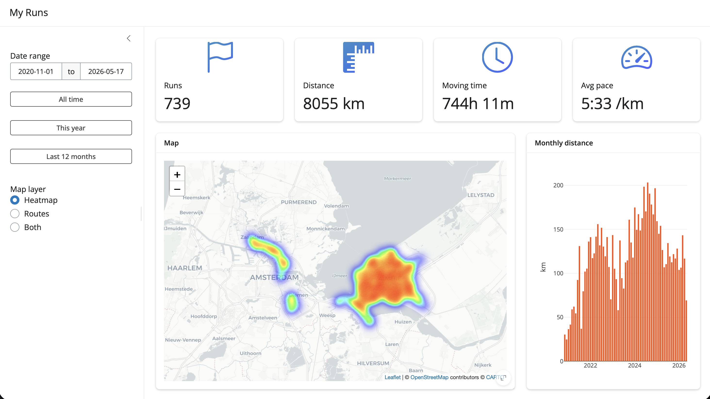

# My Runs

R Shiny app that plots your Strava runs on a map, with a street-level heatmap,
date filtering, and summary stats.



## Setup

The raw Strava export (`Strava_260517/`) is not checked into this repo (it
contains precise GPS traces). Place your export at the project root so the
structure looks like:

```
Strava_maps/
  Strava_260517/export_71201777/activities.csv
  Strava_260517/export_71201777/activities/*.gpx
  data_prep/
  app/
```

Install R packages once:

```r
install.packages(c(
  "shiny", "bslib", "bsicons", "sf", "leaflet", "leaflet.extras",
  "dplyr", "lubridate", "tidyr", "plotly"
))
```

## Build the cache

Parses `activities.csv` and every linked GPX file into `cache/runs_sf.rds`
and `cache/heatmap_points.rds`. Run from the project root, once, and again
whenever new activities are added to the export:

```sh
Rscript data_prep/build_cache.R
```

## Run the app

```sh
cd app
Rscript -e "shiny::runApp('.')"
```
